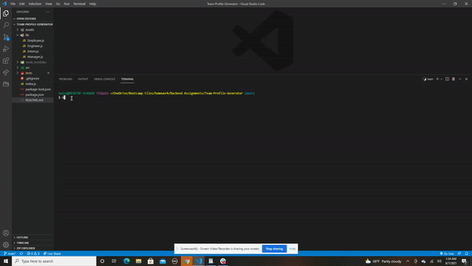
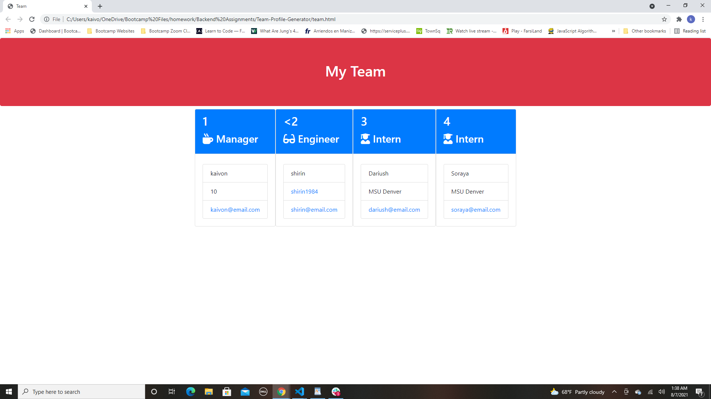

# Team-Profile-Generator

# Description

This is a Team Profile Generator. Through a series of questions that it asks the user to fill out, the user can build their team profile. Once all the questions have been answered and there are no more profiles you want to build, simply press none and it will generate a team.html with cards that are specific to the employee's role!

# How To Use

You can open an integrated terminal from the index.js and build your package-lock.json by running npm i, then once those have been downloaded, you can put node index.js and start filling out the questions that are prompted. Once you have put in all the profiles of employee's that you have, select none and it will generate the team.html profile page like described above! 

# Technology Used

- Node.js
- Jest
- Inquirer
- HTML
- CSS

# Screenshots of pages working

GIF OF TESTS AND APP WORKING SMOOTHLY

SCREEENSHOT OF GENERATED TEAM.HTML

# Contact 

Any questions or concerns about this app, please contact me:

Github: https://github.com/kaivont85
Email: kaivont@gmail.com
